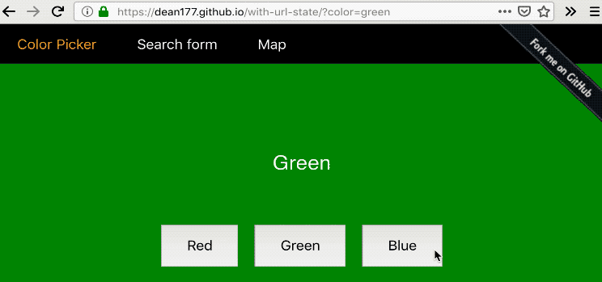

# with-url-state

[](https://circleci.com/gh/Dean177/with-url-state)
[](https://codecov.io/gh/Dean177/with-url-state)
[](https://www.npmjs.com/package/with-url-state)

Lifts the state out of a react component and into the url



## Hooks

There is a [hook](https://reactjs.org/docs/hooks-intro.html) based api available on the [3.0.0](https://github.com/Dean177/with-url-state/tree/3.0.0) branch, published as a beta on [npm](https://www.npmjs.com/package/with-url-state/v/3.0.0-beta.0).

## Installation

To install with npm use

`npm install with-url-state --save`

To install with yarn use

`yarn add with-url-state`

## Usage

Check out the the [demo](https://dean177.github.io/with-url-state/) view the [code](https://github.com/Dean177/with-url-state/tree/master/demo) or play with it in [CodeSandbox](https://codesandbox.io/s/18x4l87yx7). 

Using javascript

```javascript
import React from 'react'
import { withUrlState } from 'with-url-state'

const enhance = withUrlState(props => ({ color: 'blue' }))

export const UrlForm = enhance(props => (
  <div className="UrlForm">
    <div className="current-state" style={{ backgroundColor: props.urlState.color }}>
      <div>{props.urlState.color}</div>
    </div>
    <div className="color-buttons">
      <button className="Red" onClick={() => props.setUrlState({ color: 'red' })}>
        Red
      </button>
      <button className="Green" onClick={() => props.setUrlState({ color: 'green' })}>
        Green
      </button>
      <button className="Blue" onClick={() => props.setUrlState({ color: 'blue' })}>
        Blue
      </button>
    </div>
  </div>
))
```

Using typescript

```typescript jsx
import React from 'react'
import { withUrlState, UrlStateProps } from 'with-url-state'

type OwnProps = {}
type UrlState = { color: string }

const enhance = withUrlState<UrlState, OwnProps>((prop: OwnProps) => ({ color: 'blue' }))

export const UrlForm = enhance((props: OwnProps & UrlStateProps<UrlState>) => (
  <div className="UrlForm">
    <div className="current-state" style={{ backgroundColor: props.urlState.color }}>
      <div>{props.urlState.color}</div>
    </div>
    <div className="color-buttons">
      <button className="Red" onClick={() => props.setUrlState({ color: 'red' })}>
        Red
      </button>
      <button className="Green" onClick={() => props.setUrlState({ color: 'green' })}>
        Green
      </button>
      <button className="Blue" onClick={() => props.setUrlState({ color: 'blue' })}>
        Blue
      </button>
    </div>
  </div>
))
```

Using the render-prop component

```typescript jsx
import React from 'react'
import { UrlState } from 'with-url-state'

type OwnProps = {}
type UrlState = { color: string }

export const UrlForm = (props: OwnProps) => (
  <UrlState
    initialState={{ color: 'green' }}
    render={({ setUrlState, urlState }) => (
      <div className="UrlForm">
        <div className="current-state" style={{ backgroundColor: urlState.color }}>
          <div>{urlState.color}</div>
        </div>
        <div className="color-buttons">
          <button className="Red" onClick={() => setUrlState({ color: 'red' })}>
            Red
          </button>
          <button className="Green" onClick={() => setUrlState({ color: 'green' })}>
            Green
          </button>
          <button className="Blue" onClick={() => setUrlState({ color: 'blue' })}>
            Blue
          </button>
        </div>
      </div>
    )}
  />
)
```

## Motivation

`with-url-state` automates the query parameter manipulations, simplifying URL sharing for search results, querying data or tracking a visible portion of a map.

The api provided is:

- based on [higer-order-components](https://reactjs.org/docs/higher-order-components.html) which makes it composable and testable
- has a render-prop alternative for convenience
- type-safe thanks to [Typescript](https://www.typescriptlang.org/)
- very similar to [Reacts built in state](https://reactjs.org/docs/state-and-lifecycle.html) apis, so converting a component which already manages state is usually as simple as replacing `setState` with `setUrlState`!


## Pollyfill

For use in IE11 you will need [https://github.com/kumarharsh/custom-event-polyfill](https://github.com/kumarharsh/custom-event-polyfill)
and add `import 'custom-event-polyfill';` 
`if (typeof Event !== 'function') { window.Event = CustomEvent; }` to the upper scope of your application. 
